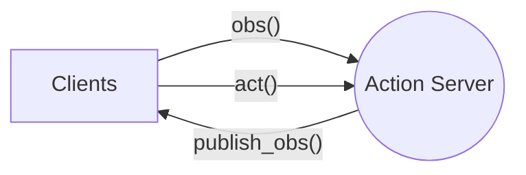
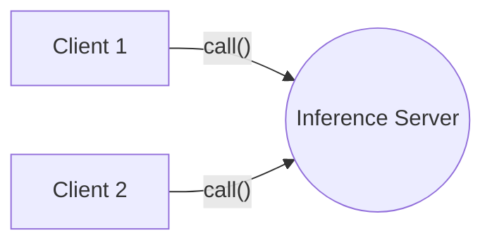
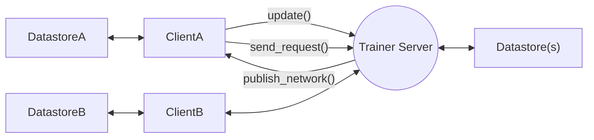

# edgeml

A simple framework for distributed machine learning library for edge computing. Given the compute limitations of many edge devices, especially in terms of GPU capabilities, EdgeML facilitates distributed data streams from these devices to GPU-enhanced computes. Utilizing a client-server architecture, the library establishes handles the transport layer of numerous clients and a server.

## Installation

```bash
pip install -e .
```

For ReplayBuffer datastore functionality, install [jax](https://jax.readthedocs.io/en/latest/installation.html).

## Quick Start

1. Video streamer example

```bash
python3 examples/action_streamer.py --server
```

On a different terminal, you can also run it on a different machine and provide custom ip address and port number. e.g. `--ip 100.10.23.23`

```bash
python3 examples/action_streamer.py --client
```

2. Replay buffer example

```bash
python3 examples/simple_replay_buffer.py

## then try out --server and --client mode on 2 separate terminals
```

3. Async learner-actor with Gym RL env (requires `jaxrl_m` as dependency)

```bash
# Indicate --learner or --actor mode, no tag means async multithreaded mode
# provide --ip for remote connection, default is localhost
# use --render to render the gym env
python3 examples/async_learner_actor.py
```

---

## Architecture

There are three types of server-client main types of classes for user to use, according to their application. Functional programming is mainly used as the API design. User can define their own callback function to process the data. There are 3 primary modes: `action`, `inference`, `trainer`.

1. **Action service (edge device) as server: `edgeml.ActionServer` and `edgeml.ActionClient`**
   - `ActionServer` provides observation to client
   - `ActionClient` can provide further action to server (Optional)

For a Reinforcement learning setting, this action server can be considered as a `EnvServer`, which takes in action and return obs. The term of `ActionServer` is to make it more general for other applications other than RL.

*Multi-clients can connect to a edge server. client can call `obs`, `act` impl, and server can call `publish_obs` method. The method is shown in the diagram below.*



1. **Inference compute as server: `edgeml.InferenceServer` and `edgeml.InferenceClient`**
   - `InferenceClient` provides observation to server and gets prediction

*Multi-client to call inference compute. client can call the `call` method*



3. **Trainer compute as server: `edgeml.TrainerServer` and `edgeml.TrainerClient`**
   - `TrainerClient` provides consistent datastore update to server and gets new network

This supports distributed datastore, and enable multiple clients to send data to server. The server can then publish the new network to all clients.

*Clients can keep their own instance of their datastore, can call the `update()` method to provide the latest datastore update to the trainer server. Trainer can have its own instance of the datastore, retrieve the data and provide the trained network to client via `publish_network()` method*



---

## Example Usage

> For more examples, please refer to the test scripts in `edgeml/tests/` and `examples`.

1. **A RL Env as Action Server**

The environment can send observations to a remote client. The client, in turn, can provide actions to the environment server. This uses the `edgeml.ActionServer` and `edgeml.ActionClient` classes.

**GPU Compute as client**
```py
model = load_model()
agent = edgeml.ActionClient('localhost', 6379, task_id='mnist', config=agent_config)

for _ in range(100):
    observation = agent.get_observation()
    prediction = model.predict(observation)
    agent.send_action(prediction)
```

**Edge device as server**
```py
def action_callback(key, action):
    # TODO: process action here
    return {"status": "received"}

def observation_callback(keys):
    # TODO: return the desired observations here
    return {"cam1": "some_value"}

config = edgeml.ActionConfig(port_number=6379, action_keys=['move'], observation_keys=['cam1'])
agent_server = edgeml.ActionServer(config, observation_callback, action_callback)
agent_server.start()
```

2. **Agent as client and inference as server**

This uses the `edgeml.InferenceServer` and `edgeml.InferenceClient` classes. This is useful for low power edge devices that cannot run inference locally.

**Inference server**
```py
def predict(payload):
    # TODO: do some prediction based on payload
    return {"prediction": "some_value"}

inference_server = edgeml.InferenceServer(port_num=6379)
inference_server.register_interface("voice_reg", predict)
inference_server.register_interface("face_reg", predict)
inference_server.start()
```

**Client**
```py
client = edgeml.InferenceClient('localhost', 6379)
res = client.call("voice_reg", {"audio": "serialized_audio"})
```

3. **Remote Training Example for an RL Application**

A remote trainer can access the datastore updated by edge devices (Agents) and sends updated network back. The Agent then updates its model with these new network. This uses the `edgeml.TrainerServer` and `edgeml.TrainerClient` classes.


**Client**

```py
env = gym.make('CartPole-v0')
observation = env.reset()

# create data store and register to trainer client
data_store = edgeml.data.ReplayBuffer(capacity=2)
trainer_client = edgeml.TrainerClient(
    "agent1", 'localhost', TrainerConfig(), data_store)

agent = make_agent()  # Arbitrary RL agent

# register callback function to receive new weights
def _recv_weights(new_weights):
    nonlocal agent
    agent.update_weights(new_weights)

trainer_client.recv_network_callback(_recv_weights)

# automatically update datastore every 10 seconds
trainer.client.start_async_update(interval=10)

# Run training steps
while True:
    action = agent.get_action(observation)
    _data_point = env.step(action)
    data_store.insert(_data_point)
```

**Trainer (Remote compute)**

```py
trainer_server = edgeml.TrainerServer(edgeml.TrainerConfig())

# create datastore in server
data_store = edgeml.data.ReplayBuffer(capacity=2)
trainer_server.register_data_store("agent1", data_store)

trainer_server.start(threaded=True)

while True:
    time.sleep(10) # every 10 seconds
    _data = data_store.sample(...) # sample data from datastore
    new_weights = AGENT.train(_data)
    trainer_server.publish_network(new_weights)
```

---

## Additional Notes

- Run test cases to make sure everything is working as expected.

```bash
python3 edgeml/tests/test_action.py
python3 edgeml/tests/test_inference.py
python3 edgeml/tests/test_trainer.py

# Run all tests
python3 edgeml/tests/test_all.py

# Run specific test
pytest-3 edgeml/tests/test_replay_buffer.py
```

- The current implementation mainly uses zeromq as communication protocol, it should be easy to extend it to support other protocols such as grpc. (TODO: impl abstract function when there is a need)
