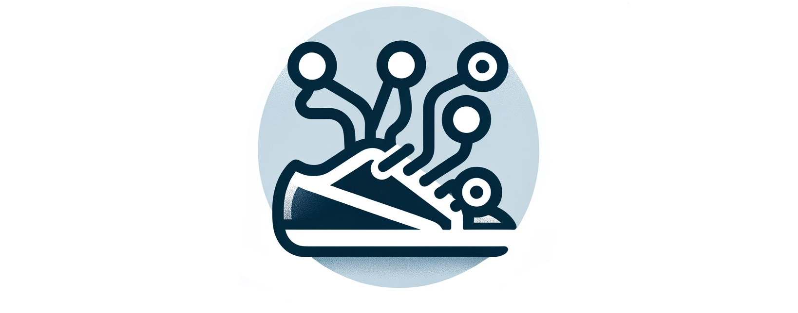
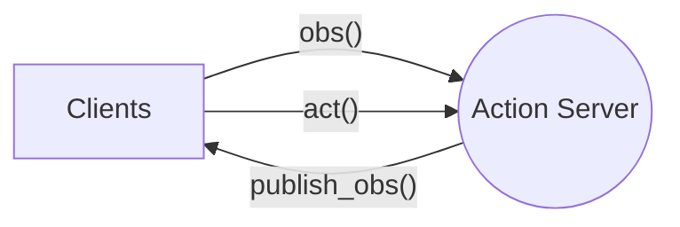
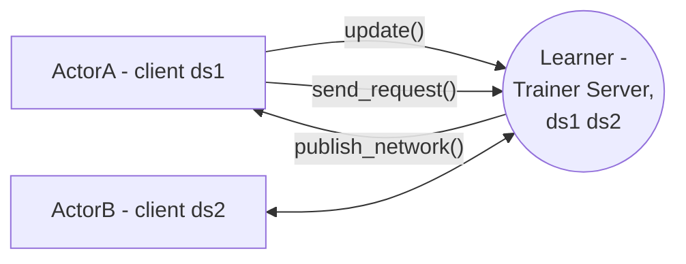
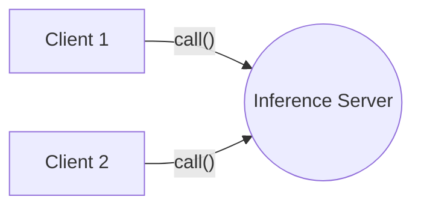

# Agentlace



A simple framework for distributed machine learning applications for agent (policy). In many instances we would like to run the agent in a distributed manner (e.g. async, different process, thread, env, or machine). Agentlace faccilites the distributed data stream of nodes, making this connection seamless. Built on a client-server architecture, Agentlace efficiently manages the transport layer for multiple clients and a central server.


> [SERL (A Software Suite for Sample-Efficient Robotic Reinforcement Learning)](https://github.com/rail-berkeley/serl) provides working examples on how to use `agentlace` for distributed reinforcement learning via learner and actor.

> [Manipulator Gym](https://github.com/rail-berkeley/manipulator_gym) provides a working example on how to use `agentlace` of separating the environment and policy in a distributed manner.

## Installation

```bash
cd agentlace
pip install -e .
```

## Quick Start

1. **Video streamer example**

This showcases how we can use agentlace to stream a video footage of an agent server to a client. The client can also send custom action to the agent. This is helpful when we want to run a lite actor on an edge device, and a big policy on a remote GPU server.

```bash
python3 examples/action_streamer.py --server
```

On a different terminal, you can also run it on a different machine and provide custom ip address and port number. e.g. `--ip 100.10.23.23`

```bash
python3 examples/action_streamer.py --client
```

2. **Gym Env as action server**

Say we have a simple `env = gym.make('CartPole-v1')` environment. Run example: `python3 examples/action_cartpole_env.py`

We can use agentlace to run the environment as a server, and the client can send action to the server in a distributed manner. Meanwhile, we still retain the gym API on the client and server side.

```bash
# Run the server first
python3 examples/action_cartpole_env.py --server
# Run the client on a different terminal
python3 examples/action_cartpole_env.py --client
```

3. **Async learner-actor with Gym RL env**

Requires [jax](https://jax.readthedocs.io/en/latest/installation.html), [jaxrl_m](https://github.com/rail-berkeley/jaxrl_minimal), [mujuco-py](https://github.com/openai/mujoco-py#install-mujoco) as dependencies.

This showcases how we can enable distributed training for RL applications. The learner can be run on a remote GPU server, while the actor can be run on a edge device. Off-policy RL algorithim (SAC) is used in this example.

```bash
# Indicate --learner or --actor mode, no tag means async multithreaded mode
# provide --ip for remote connection, default is localhost
python3 examples/async_learner_actor.py
```

**More option flags**:
 - `--env`: gym env name, default is `HalfCheetah-v4`
 - `--learner`: run learner mode
 - `--actor`: run actor mode
 - `--ip`: ip address of the remote server
 - `--render`: render the gym env
 - `--use_traj_buffer`: use trajectory buffer instead of replay buffer
 - `--rlds_log_dir`: directory to save the tfrecords for [RLDS](https://github.com/google-research/rlds)

NOTE: rlds logger requires installation of [oxe_envlogger](https://github.com/rail-berkeley/oxe_envlogger)

---

## Architecture

There are three types of server-client main types of classes for user to use, according to their application. Functional programming is mainly used as the API design. User can define their own callback function to process the data. There are 3 primary modes: `action`, `inference`, `trainer`.

1. **Action service (edge device) as server: `agentlace.ActionServer` and `agentlace.ActionClient`**
   - `ActionServer` provides observation to client, and execute action sent by client
   - `ActionClient` provides action to server, and get observation from server

For a Reinforcement learning setting, this action server can be considered as a `EnvServer`, which takes in action and return obs. The term of `ActionServer` is to make it more general for other applications other than RL.

*Multi-clients can connect to the action server. client can call `obs`, `act` impl, and server can call `publish_obs` method. The method is shown in the diagram below.*



2. **Trainer compute as server: `agentlace.TrainerServer` and `agentlace.TrainerClient`**
   - `TrainerClient` provides consistent datastore update to server and gets new network

This enables distributed datastore (ds1 and ds2), and enables multiple clients to send data to server. The server can then publish the new network to all clients.

*Clients keep their own instance of their datastore, call the `update()` method to provide the latest datastore update to the trainer server via an internal datastore (ReplayBuffer). The trainer retrieve data from the datastore and provide the trained network to client via `publish_network()` method*



1. **Inference compute as server: `agentlace.InferenceServer` and `agentlace.InferenceClient`**
   - `InferenceClient` provides observation to server and gets prediction

*Multi-client to call inference compute. client can call the `call` method*



---

## Example Usage

> For more examples, please refer to the test scripts in `tests/` and `examples/`.

1. **A RL Env as Action Server**

The environment can send observations to a remote client. The client, in turn, can provide actions to the environment server. This uses the `agentlace.ActionServer` and `agentlace.ActionClient` classes.

<details>
<summary>Click to show code example</summary>

**GPU Compute as client** 

```py
model = load_model()
agent = agentlace.ActionClient('localhost', 6379, task_id='mnist', config=agent_config)

for _ in range(100):
    observation = agent.obs()
    prediction = model.predict(observation)
    agent.act("send", prediction)
```

**Edge device as server**
```py
def action_callback(key, action):
    # TODO: process action here
    return {"status": "received"}

def observation_callback(keys):
    # TODO: return the desired observations here
    return {"cam1": "some_value"}

config = agentlace.ActionConfig(port_number=6379, action_keys=['move'], observation_keys=['cam1'])
agent_server = agentlace.ActionServer(config, observation_callback, action_callback)
agent_server.start()
```
</details>

2. **Remote Training Example for an RL Application**

A remote trainer can access the datastore updated by devices/actors and sends updated network back. The actors then updates its model with these new network. This uses the `agentlace.TrainerServer` and `agentlace.TrainerClient` classes.

<details>
<summary>Click to show code example</summary>

**Client**

```py
env = gym.make('CartPole-v0')
observation = env.reset()

# create data store and register to trainer client
data_store = agentlace.data.ReplayBuffer(capacity=2)
trainer_client = agentlace.TrainerClient(
    "agent1", 'localhost', TrainerConfig(), data_store)

agent = make_agent()  # Arbitrary RL agent

# register callback function to receive new weights
def _recv_weights(new_weights):
    nonlocal agent
    agent.update_weights(new_weights)

trainer_client.recv_network_callback(_recv_weights)

# automatically update datastore every 10 seconds
trainer.client.start_async_update(interval=10)

# Run training steps
while True:
    action = agent.get_action(observation)
    _data_point = env.step(action)
    data_store.insert(_data_point)
```

**Trainer (Remote compute)**

```py
trainer_server = agentlace.TrainerServer(agentlace.TrainerConfig())

# create datastore in server
data_store = agentlace.data.ReplayBuffer(capacity=2)
trainer_server.register_data_store("agent1", data_store)
trainer_server.start(threaded=True)

while True:
    time.sleep(10) # every 10 seconds
    _data = data_store.sample(...) # sample data from datastore
    new_weights = AGENT.train(_data)
    trainer_server.publish_network(new_weights)
```
</details>


3. **Agent as client and inference as server**

This uses the `agentlace.InferenceServer` and `agentlace.InferenceClient` classes. This is useful for low power edge devices that cannot run inference locally.

<details>
<summary>Click to show code example</summary>

**Inference server**
```py
def predict(payload):
    # TODO: do some prediction based on payload
    return {"prediction": "some_value"}

inference_server = agentlace.InferenceServer(port_num=6379)
inference_server.register_interface("voice_reg", predict)
inference_server.register_interface("face_reg", predict)
inference_server.start()
```

**Client**
```py
client = agentlace.InferenceClient('localhost', 6379)
res = client.call("voice_reg", {"audio": "serialized_audio"})
```
</details>


---

## Additional Notes

- Run test cases to make sure everything is working as expected.

```bash
python3 tests/test_action.py
python3 tests/test_inference.py
python3 tests/test_trainer.py
python3 tests/test_tfds.py

# Run all tests
python3 tests/test_all.py

# Run specific test
pytest-3 tests/test_data_store.py
```

- The current implementation mainly uses zeromq as communication protocol, it should be easy to extend it to support other protocols such as grpc. (TODO: impl abstract function when there is a need)

## Citation

```bibtex
@software{agentlace2024,
  author = {You Liang Tan},
  title = {Agentlace, framework for distributed agent policy},
  month = May,
  year = 2024,
  url = {https://github.com/youliangtan/agentlace},
}
```
