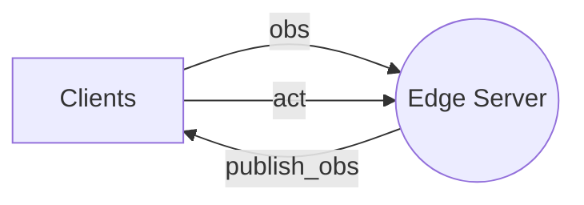
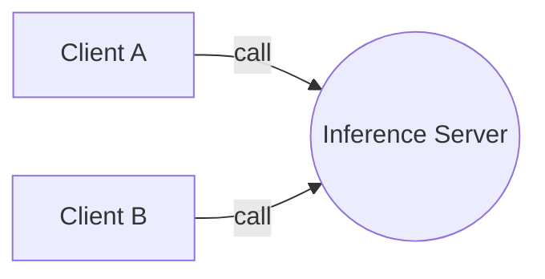
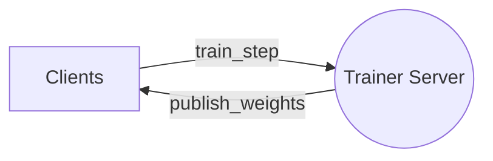

# edgeml

It is common for edge device to be limited by GPU compute. This library enables distributed datastream from edge device to GPU compute for various ml applications. The lib mainly based on client-server architecutre, enable simple TCP communication between multiple clients to server.

## Installation

```bash
pip install -e .
```

## Run example

```bash
python3 example.py --server
```

On a different terminal, you can also run it on a different machine and provide custom ip address and port number. e.g. `--ip 100.10.23.23`

```bash
python3 example.py --client
```

---

## Architecture

1. **Edge device as server: `edgeml.EdgeServer` and `edgeml.EdgeClient`**
   - `EdgeServer` provides observation to client
   - `EdgeClient` can provide further action to server (Optional)

*Multi-clients can connect to a edge server. client can call `obs`, `act` impl, and server can call `publish_obs` method. The method is shown in the diagram below.*



2. **Inference compute as server: `edgeml.InferenceServer` and `edgeml.InferenceClient`**
   - `InferenceClient` provides observation to server and gets prediction

*Multi-client to call inference compute. client can call the `call` method*



3. **Trainer compute as server: `edgeml.TrainerServer` and `edgeml.TrainerClient`**
   - `TrainerClient` provides observation to server and gets new weights

*Multi-client to call trainer compute. client can call the `train_step` method. `publish_weights` method can also be used to publish weights to all clients. `get_data` method can be used to get cached data from clients.*



---

## Example Usage

1. **Edge Device as Server**

An edge device (Agent) can send observations to a remote client. The client, in turn, can provide actions to the agent based on these observations. This uses the `edgeml.EdgeServer` and `edgeml.EdgeClient` classes.

**GPU Compute as client**
```py
model = load_model()
agent = edgeml.EdgeClient('localhost', 6379, task_id='mnist', config=agent_config)

for _ in range(100):
    observation = agent.get_observation()
    prediction = model.predict(observation)
    agent.send_action(prediction)
```

**Edge device as server**
```py
def action_callback(key, action):
    # TODO: process action here
    return {"status": "received"}

def observation_callback(keys):
    # TODO: return the desired observations here
    return {"observation": "some_value"}

config = edgeml.EdgeConfig(port_number=6379, action_keys=['action'], observation_keys=['observation'])
agent_server = edgeml.EdgeServer(config, observation_callback, action_callback)
agent_server.start()
```

3. **Agent as client and inference as server**

This uses the `edgeml.InferenceServer` and `edgeml.InferenceClient` classes. This is useful for low power edge devices that cannot run inference locally.

**Inference server**
```py
def predict(payload):
    # TODO: do some prediction based on payload
    return {"prediction": "some_value"}

inference_server = edgeml.InferenceServer(port_num=6379)
inference_server.register_interface("voice_reg", predict)
inference_server.register_interface("face_reg", predict)
inference_server.start()
```

**Client**
```py
client = edgeml.InferenceClient('localhost', 6379)
res = client.call("voice_reg", {"audio": "serialized_audio"})
```

2. **Remote Training Example for an RL Application**

A remote trainer receives observations from an edge device (Agent) and sends updated weights back. The Agent then updates its model with these new weights. This uses the `edgeml.TrainerServer` and `edgeml.TrainerClient` classes.

**Client**

```py
env = gym.make('CartPole-v0')
observation = env.reset()
config = edgeml.TrainerConfig(port_number=6379, broadcast_port=6380)
trainer = edgeml.TrainerClient('localhost', config)
agent = make_agent()  # Arbitrary agent

while True:
    action = agent.get_action(observation)
    observation, reward, done, info = env.step(action)
    # or we can use callback function to receive new weights
    new_weights = trainer.train_step({"observation": observation})
    agent.update_weights(new_weights)
```

**Trainer (Remote compute)**

```py
def train_step(payload):
    # TODO: do some training based on observation
    return new_weights

config = edgeml.TrainerConfig(port_number=6379, broadcast_port=6380)
trainer_server = edgeml.TrainerServer(config, train_step)
trainer_server.start()
```
