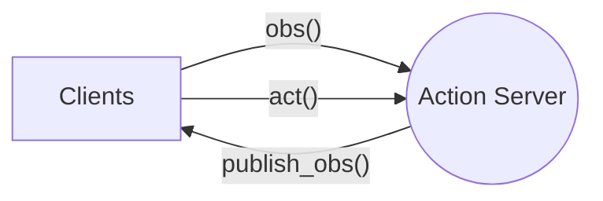
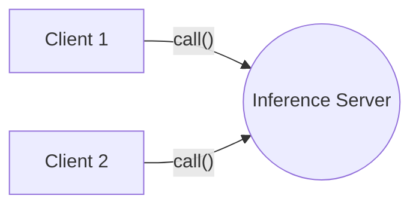
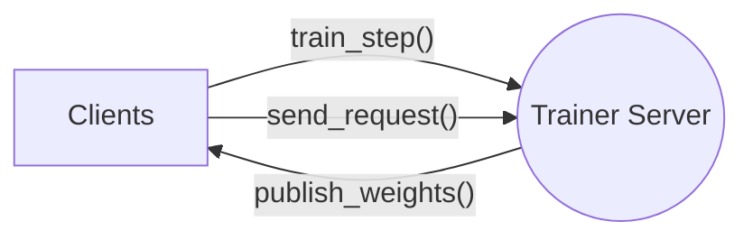

# edgeml

A simple framework for distributed machine learning library for edge computing. It is common for edge device to be limited by GPU compute. This library enables distributed datastream from edge device to GPU compute for various ml applications. The lib mainly based on client-server architecutre, enable simple TCP communication between multiple clients to server.

## Installation

```bash
pip install -e .
```

## Run example

```bash
python3 example.py --server
```

On a different terminal, you can also run it on a different machine and provide custom ip address and port number. e.g. `--ip 100.10.23.23`

```bash
python3 example.py --client
```

---

## Architecture

There are three types of server-client main types of classes for user to use, according to their application. Functional programming is mainly used as the API design. User can define their own callback function to process the data. There are mainly 3 modes: `action`, `inference`, `trainer`.

1. **Action service (edge device) as server: `edgeml.ActionServer` and `edgeml.ActionClient`**
   - `ActionServer` provides observation to client
   - `ActionClient` can provide further action to server (Optional)

For a Reinforcement learning setting, this action server can be considered as a `EnvServer`, which takes in action and return obs. The term of `ActionServer` is to make it more general for other applications other than RL.

*Multi-clients can connect to a edge server. client can call `obs`, `act` impl, and server can call `publish_obs` method. The method is shown in the diagram below.*



1. **Inference compute as server: `edgeml.InferenceServer` and `edgeml.InferenceClient`**
   - `InferenceClient` provides observation to server and gets prediction

*Multi-client to call inference compute. client can call the `call` method*



3. **Trainer compute as server: `edgeml.TrainerServer` and `edgeml.TrainerClient`**
   - `TrainerClient` provides observation to server and gets new weights

*Multi-client to call trainer compute. client can call the `train_step` method. `publish_weights` method can also be used to publish weights to all clients. `get_data` method can be used to get cached data from clients.*



---

## Example Usage

> For detailed example, please refer to the test scripts in `edgeml/tests/`.

1. **A RL Env as Action Server**

The environment can send observations to a remote client. The client, in turn, can provide actions to the environment server. This uses the `edgeml.ActionServer` and `edgeml.ActionClient` classes.

**GPU Compute as client**
```py
model = load_model()
agent = edgeml.ActionClient('localhost', 6379, task_id='mnist', config=agent_config)

for _ in range(100):
    observation = agent.get_observation()
    prediction = model.predict(observation)
    agent.send_action(prediction)
```

**Edge device as server**
```py
def action_callback(key, action):
    # TODO: process action here
    return {"status": "received"}

def observation_callback(keys):
    # TODO: return the desired observations here
    return {"cam1": "some_value"}

config = edgeml.ActionConfig(port_number=6379, action_keys=['move'], observation_keys=['cam1'])
agent_server = edgeml.ActionServer(config, observation_callback, action_callback)
agent_server.start()
```

1. **Agent as client and inference as server**

This uses the `edgeml.InferenceServer` and `edgeml.InferenceClient` classes. This is useful for low power edge devices that cannot run inference locally.

**Inference server**
```py
def predict(payload):
    # TODO: do some prediction based on payload
    return {"prediction": "some_value"}

inference_server = edgeml.InferenceServer(port_num=6379)
inference_server.register_interface("voice_reg", predict)
inference_server.register_interface("face_reg", predict)
inference_server.start()
```

**Client**
```py
client = edgeml.InferenceClient('localhost', 6379)
res = client.call("voice_reg", {"audio": "serialized_audio"})
```

2. **Remote Training Example for an RL Application**

A remote trainer receives observations from an edge device (Agent) and sends updated weights back. The Agent then updates its model with these new weights. This uses the `edgeml.TrainerServer` and `edgeml.TrainerClient` classes.

**Client**

```py
env = gym.make('CartPole-v0')
observation = env.reset()

def recv_weights(new_weights):
    agent.update_weights(new_weights)

config = TrainerConfig(data_table=[DataTable(name="agent1", size=2)])
trainer = edgeml.TrainerClient('localhost', config)
trainer.register_callback(recv_weights)
agent = make_agent()  # Arbitrary agent

while True:
    action = agent.get_action(observation)
    observation, reward, done, info = env.step(action)
    # or we can use callback function to receive new weights
    trainer.train_step("agent1", {"observation": observation})
    agent.update_weights(new_weights)
```

**Trainer (Remote compute)**

```py
def train_step(table_name, payload):
    # TODO: do some training based on observation
    MagicLearner().insert(payload)
    return {} # optional return new weights

config = edgeml.TrainerConfig(data_table=[DataTable(name="agent1", size=2)])
trainer_server = edgeml.TrainerServer(config, train_step)
trainer_server.start(threaded=True)
while True:
    time.sleep(10) # every 10 seconds
    new_weights = MagicLearner().train()
    trainer_server.publish_weights(new_weights)
```

## Notes

- Run test cases to make sure everything is working as expected.

```bash
python3 edgeml/tests/test_action.py
python3 edgeml/tests/test_inference.py
python3 edgeml/tests/test_trainer.py

# Run all tests
python3 edgeml/tests/test_all.py
```

- The current implementation mainly uses zeromq as communication protocol, it should be easy to extend it to support other protocols such as grpc. (TODO: impl abstract function when there is a need)
